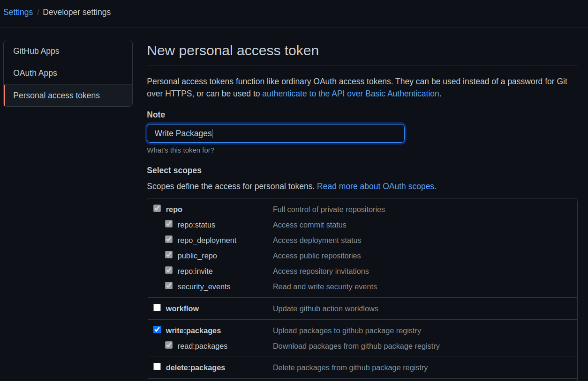

# Kotlin CI Template

If you're using this template don't forget to add a personal access token with the privileges to write packages in your repository secrets (`GH_PAT_PACKAGES`):

You can generate this access token in your github account settings (Settings -> Developer settings -> Personal Access Tokens -> Generate new Token):

